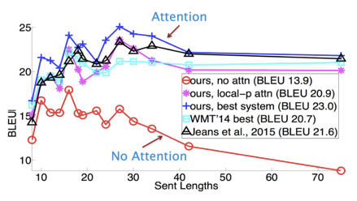
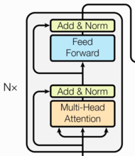

# TransformCopy
# 1.Transformer背景介绍
* 2018年10月，Google发出一篇论文《BERT: Pre-training of Deep Bidirectional Transformers for Language Understanding》, BERT模型横空出世, 并横扫NLP领域11项任务的最佳成绩!

## 1.1 Transformer的优势¶
* 相比之前占领市场的LSTM和GRU模型，Transformer有两个显著的优势:

* 1, Transformer能够利用分布式GPU进行并行训练，提升模型训练效率.
* 2, 在分析预测更长的文本时, 捕捉间隔较长的语义关联效果更好.
* 比较图：

# 2.Transformer架构
## 2.1 Transformer模型的作用
* 基于seq2seq架构的transformer模型可以完成NLP领域研究的典型任务, 如机器翻译, 文本生成等. 同时又可以构建预训练语言模型，用于不同任务的迁移学习.
* 声明
* 在接下来的架构分析中, 我们将假设使用Transformer模型架构处理从一种语言文本到另一种语言文本的翻译工作, 因此很多命名方式遵循NLP中的规则. 比如: Embeddding层将称作文本嵌入层, Embedding层产生的张量称为词嵌入张量, 它的最后一维将称作词向量等.

# 3. Transformer总体架构可分为四个部分:

* 输入部分
* * 输出部分
* 编码器部分
* 解码器部分
* 架构图：

## 3.1 输入部分包含:

* 源文本嵌入层及其位置编码器
* 目标文本嵌入层及其位置编码器

## 3.2 输出部分包含:
* 线性层
* softmax层

## 3.3 编码器部分:
* 由N个编码器层堆叠而成
* 每个编码器层由两个子层连接结构组成
* 第一个子层连接结构包括一个多头自注意力子层和规范化层以及一个残差连接
* 第二个子层连接结构包括一个前馈全连接子层和规范化层以及一个残差连接

## 3.4 解码器部分:

* 由N个解码器层堆叠而成
* 每个解码器层由三个子层连接结构组成
* 第一个子层连接结构包括一个多头自注意力子层和规范化层以及一个残差连接
* 第二个子层连接结构包括一个多头注意力子层和规范化层以及一个残差连接
* 第三个子层连接结构包括一个前馈全连接子层和规范化层以及一个残差连接

# 4.训练结果

